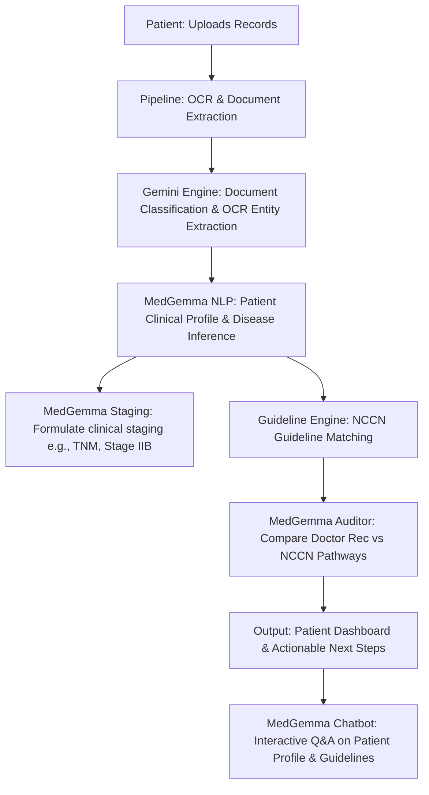

# Implementation Plan: Medical History Synthesis & NCCN Guidelines Validator (Kaggle Capstone Edition)

This document outlines the product requirements and technical design for the **OncoCompanion (or Medical History Synthesis System)**. This system is designed as a submission for the [Kaggle Vibe-Coding Agents Capstone Project Competition](https://www.kaggle.com/competitions/vibecoding-agents-capstone-project). 

The application enables patients to upload their medical history (PDFs, images, text), automatically extracts and synthesizes key clinical facts using **MedGemma** and Gemini, and audits doctor recommendations against the National Comprehensive Cancer Network (NCCN) guidelines.

---

## 1. Product Vision & User Flow

### The Problem
When diagnosed with cancer or complex diseases, patients are overwhelmed with medical jargon, disparate reports (radiology, pathology, labs), and differing doctor recommendations. They often want a second opinion or want to verify if their recommended treatment aligns with established standards (like NCCN guidelines) and understand what steps or tests are missing.

### The Solution
A secure, patient-centric web application that:
1. **Ingests & Classifies**: Accepts medical PDFs, images, and text notes. Extracts unstructured data and organizes it chronologically.
2. **Synthesizes & Stages**: Synthesizes the clinical history to infer the disease, stage, biomarkers, and current health status.
3. **NCCN Compliance Check**: Compares the doctor’s documented recommendation against NCCN clinical guidelines to verify alignment, list discrepancies, and suggest missing tests/workup.
4. **Interactive Patient Chatbot**: Allows patients to ask follow-up questions in plain language about their records and the guidelines.

### User Flow


---

## 2. System Architecture

We propose a modern full-stack application built using:
- **Frontend**: Next.js (React) + TypeScript + Tailwind CSS for a premium, accessible dashboard.
- **Backend**: FastAPI (Python) for fast API endpoints, background processing tasks, and integration with the ADK workflow framework.
- **Database / Vector Store**: ChromaDB or PgVector for document embeddings and RAG search. PostgreSQL for patient metadata and audit logs.
- **GenAI / Medical NLP**: 
  - **MedGemma**: Used for all clinical synthesis, medical inference, NCCN guidelines compliance auditing, and plain-language patient chatbot responses.
  - **Google Gemini 2.5 Flash**: Used as the multimodal OCR parser and document classifier.

### Proposed Code Directory Structure

We plan to create a dedicated directory `/medical_app` in the workspace with the following layout:

```text
medical_app/
├── app/
│   ├── main.py                 # FastAPI Application Entrypoint
│   ├── config.py               # App configuration (Vertex AI, DB, keys)
│   ├── database.py             # PostgreSQL and VectorDB connection setup
│   ├── models/
│   │   └── schemas.py          # Pydantic schemas (Document, Chat, Staging, Compliance)
│   ├── services/
│   │   ├── document_parser.py  # OCR and Multimodal extraction (Gemini Vision)
│   │   ├── clinical_nlp.py     # MedGemma Disease inference, staging, and metadata extractor
│   │   ├── guidelines_engine.py# NCCN guidelines querying and verification
│   │   └── chat_service.py     # MedGemma RAG-based Chatbot over patient files
│   └── routers/
│       ├── documents.py        # Upload, list, analyze endpoints
│       ├── compliance.py       # NCCN audit endpoints
│       └── chatbot.py          # WebSocket/HTTP streaming chat endpoints
├── frontend/                   # Next.js frontend code
│   ├── components/             # Reusable UI components (Dashboard, Chat, Records)
│   ├── pages/                  # Next.js pages
│   └── styles/                 # Tailwind CSS & global styles
├── guidelines/                 # Stored NCCN Guideline reference documents / embeddings
├── tests/                      # Pytest unit and integration tests
└── README.md
```

---

## 3. Detailed Component Designs

### A. Document Parser & Clinical NLP Service
- **Ingestion**: Supports PDF, JPG, PNG, and raw text.
- **Processing**:
  - For PDF/Images: Uses **Gemini 2.5 Flash**'s multimodal capabilities as the primary OCR/extractor, passing the document bytes directly with a strict clinical parsing prompt.
  - Generates structured output via `Pydantic` schema containing:
    - Document Type (e.g., Pathology Report, MRI Scan, CT Scan, Lab Results, Progress Note).
    - Clinical Entities: Diagnoses, Procedures, Medications, Lab Values, Tumor Markers (e.g., HER2, ER, PR, EGFR, ALK), TNM Staging parameters.
    - Doctor Recommendations: Stated next steps, surgical recommendations, chemotherapy/radiation plans.
  - Clinical Profile Synthesis: **MedGemma** synthesizes the clinical timeline from the extracted document data.

### B. The Guidelines & Compliance Engine (NCCN & others)
- **NCCN Guidelines Reference Database**: 
  - Standard guidelines (NCCN) will be pre-parsed, chunked, and stored in a vector database (`ChromaDB`).
  - Metadata tags will be applied based on Cancer Type (e.g., "Breast Cancer", "Non-Small Cell Lung Cancer") and Stage.
- **Verification Pipeline**:
  1. **Query**: The system queries the Vector DB using the inferred disease, stage, and biomarkers.
  2. **Extraction**: Retrieve the standard treatment pathways (First-Line therapy, Second-Line therapy, surgical margins, radiation schedules).
  3. **Comparison (LLM-as-a-Judge)**: **MedGemma** compares the Doctor's Recommendation (extracted from patient records) against the NCCN guidelines.
  4. **Staging Verification**: Calculates whether the documented stage aligns with clinical findings (e.g., if a tumor size is 4cm and node is positive, is the stage correctly identified as Stage IIB/III?).
  5. **Missing Information & Next Steps**: Identify if critical diagnostic steps are missing (e.g., BRCA1/2 genetic testing was not done but is recommended for this patient profile).

### C. Chatbot Engine (RAG)
- **Context Isolation**: When the user chats, the context is strictly scoped to:
  - The parsed content of *their* uploaded documents.
  - The specific NCCN guidelines matched to their diagnosis.
- **Model selection**: **MedGemma** handles the response formulation.
- **System Instructions**:
  - Speak in compassionate, patient-friendly language while remaining clinically accurate.
  - Provide a clear medical disclaimer: *"I am an AI assistant and not a medical doctor. Please consult your oncologist..."*
  - Cite references directly (e.g., *"According to your Pathology Report from 06/12/2026..."* or *"As per NCCN Breast Cancer Guidelines Version 2.2026..."*).

---

## 4. UI/UX Design & Rich Aesthetics

To achieve a "premium, state-of-the-art" feel (in accordance with Google's Web Application Development guidelines), the web application will utilize:
1. **Modern Color Palette**: Sleek dark mode / high-contrast medical theme (Deep Slate `#0F172A`, Teal/Emerald accents for safety/health `#0D9488`, Soft Indigo for AI components `#4F46E5`).
2. **Glassmorphism Panels**: Semi-transparent backing panels with backdrop filters for a futuristic, clean dashboard.
3. **Dynamic Interactive Staging Visualizer**: A visual timeline showing the patient's stage (TNM breakdown) and where their recommended treatment plan sits compared to NCCN guidelines.
4. **Clean OCR/Viewer**: Split-screen view showing the uploaded PDF on one side and the AI-extracted clinical entities on the other, allowing users to verify extraction.

---

## 5. Security, Privacy & HIPAA Compliance

> [!IMPORTANT]
> Because this application handles Protected Health Information (PHI), standard HIPAA compliance measures must be strictly addressed in the design.

- **Data Encryption**: All files stored in Google Cloud Storage must be encrypted at rest (AES-256) and in transit (TLS 1.3).
- **PII / PHI Scrubbing (Optional Toggle)**: A pre-processing step using Cloud DLP or local regex (similar to the PII scrubbers in `agent.py`) to redact SSN, Address, and Phone Numbers before sending to external model endpoints if needed, though Vertex AI in Google Cloud satisfies HIPAA Business Associate Agreements (BAA).
- **Audit Logging**: Every access, analysis, or query to patient documents must be logged with timestamp, user ID, and action taken.

---

## 6. Verification & Staged Implementation Plan

### Phase 1: Ingestion & Extraction (Week 1)
- Develop `document_parser.py` using Gemini Multimodal.
- Create UI for upload with drag-and-drop and real-time parsing progress.
- Verify parser accuracy using synthetic pathology and radiology reports.

### Phase 2: Staging & NCCN Matching (Week 2)
- Seed ChromaDB with guidelines for 2-3 major cancer types (Breast, Lung, Prostate).
- Write `guidelines_engine.py` to match extracted patient profiles with NCCN pathways.
- Develop the compliance comparison prompts for **MedGemma** and test with mock case files.

### Phase 3: Conversational Chatbot (Week 3)
- Implement `chat_service.py` using **MedGemma** with custom clinical system instructions and RAG retrieval.
- Build the streaming chat UI on the frontend.
- Evaluate the chatbot using `agents-cli eval` to prevent hallucinations and ensure safe tone.

### Phase 4: Integration, Hardening & Pre-deployment Tests (Week 4)
- Integrate all services into FastAPI.
- Complete comprehensive end-to-end integration tests.
- Set up GCP terraform infrastructure.

---

## 7. Open Questions for the User

> [!IMPORTANT]
> Please review the following questions before approving the implementation plan:
>
> 1. **Guidelines Scope**: For the initial release, should we focus on a few specific cancer types (e.g., Breast Cancer and Lung Cancer) or do we need a broad system covering all oncological guidelines from day one?
> 2. **Notable Doctor Recommendations**: How should we ingest the "notable doctor's recommendation"? Will it be parsed from clinical consult letters uploaded by the patient, or do you want a feature where the patient can manually type in what their doctor suggested?
> 3. **Medical Guidelines Source**: Besides NCCN, are there other specific guidelines you want integrated (e.g., ESMO, ASCO, or regional country-specific guidelines)?
